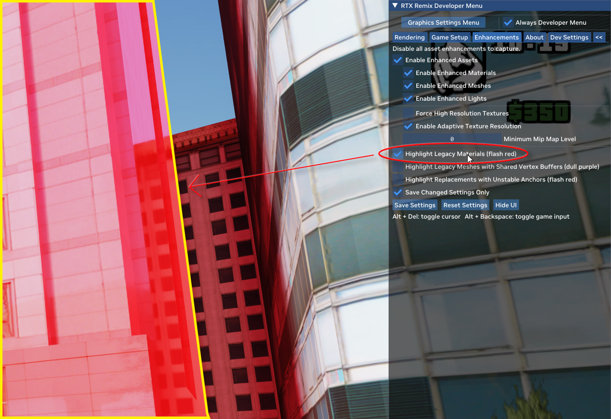

# GTASA RTX-Remix Tools
This tools is use for compare different only between your captures texture folder and rough_only.usda put this in "Your Game Folder\rtx-remix", when you use Highlight Legacy Materials in RTX-Remix in GAME Menu and see a red flashing objects, not include the car materials or anything mark as "terrain Textures" press the capture button, and run this script, than after you restart the game, the flash red object will no longer exists, and the object is not highly reflection now, If you'd like to contribute and help enhance this project, locate the file named "diff_file.data" in the "Your Game Folder\rtx-remix" directory. Additionally, the script will automatically create a folder called "new_tex" in the same directory. Please zip this folder and the "diff_file.data" together send the file to me via Discord [Hemry](https://discordapp.com/users/hemry). Once completed, you can safely delete the "new_tex" folder and the "diff_file.data" file. Your assistance is greatly appreciated!, I will use this publish a new "rough_only.usda" and the captured texture for the community.

